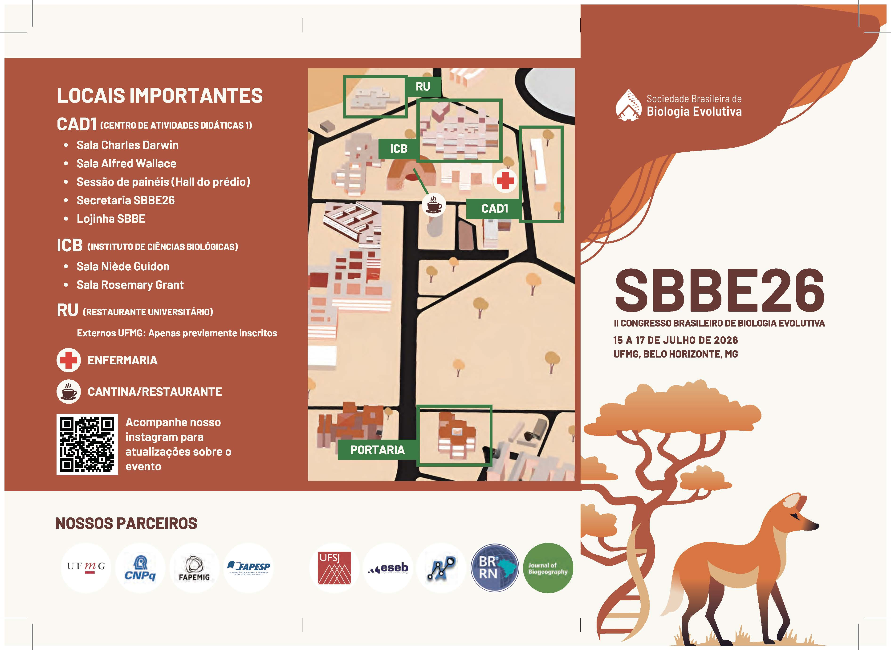
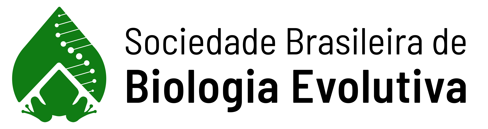

# Proposta

O trato de dados genômicos é cada vez mais comum em estudos evolutivos desenvolvidos no Brasil. Portanto, ter domínio mínimo — não somente dos métodos empregados, mas também das boas práticas envolvidas em análises genômicas — passou a ser de grande valia para biólogos evolutivos brasileiros.

Assim, o <a href="https://www.even3.com.br/ii-congresso-brasileiro-de-biologia-evolutiva-657146/" target="_blank">II Congresso da Sociedade Brasileira de Biologia Evolutiva</a> — <a href="https://www.even3.com.br/ii-congresso-brasileiro-de-biologia-evolutiva-657146/" target="_blank">SBBE26</a> oferecerá este minicurso que é voltado para pesquisadores (independentemente do estágio da carreira) que estão dando seus primeiros passos na análise de dados genômicos. Serão apresentados os tipos de sequenciamento de nova geração, os primeiros passos no processamento de dados de <i>short-reads</i> e algumas análises exploratórias iniciais.
 

A atividade ocorrerá um dia antes do início do congresso — <b>14 de julho de 2026</b> — na <b>Sala Alfred Wallace</b> do <a href="https://www.even3.com.br/ii-congresso-brasileiro-de-biologia-evolutiva-657146/" target="_blank">SBBE26</a> que fica no <a href="https://maps.app.goo.gl/mMa4sqiELH6HEEB77" target="_blank">Centro de Atividades Didáticas 1</a> — <a href="https://maps.app.goo.gl/mMa4sqiELH6HEEB77" target="_blank">CAD 1</a> da <a href="https://www.ufmg.br/" target="_blank">Universidade Federal de Minas Gerais</a> — <a href="https://www.ufmg.br/" target="_blank">UFMG</a>.

O minicurso contará com 28 <a href="http://127.0.0.1:8000/workshopgenomics/participants/" target="_blank">participantes</a> e será ministrado por
<a href="https://sbbe-oficial.github.io/workshopgenomics/team/#george-pacheco" target="_blank">George Pacheco</a>, <a href="https://sbbe-oficial.github.io/workshopgenomics/team/#mariana-vasconcellos" target="_blank">Mariana Vasconcellos</a>, <a href="https://sbbe-oficial.github.io/workshopgenomics/team/#waldir-miron" target="_blank">Waldir Miron</a>, com o auxílio dos monitores <a href="https://sbbe-oficial.github.io/workshopgenomics/team/#ana-cecilia-holler-del-prette" target="_blank">Ana Cecilia Holler del Prette</a> e <a href="https://sbbe-oficial.github.io/workshopgenomics/team/#jean-oliveira" target="_blank">Jean Oliveira</a>.

  

## Cronograma

<table style="width: 100%; border-collapse: collapse; margin-top: 20px;">
  <thead>
    <tr>
      <th style="text-align: left; padding: 8px; border-bottom: 2px solid #b84e39; font-size: 16px;">Hora</th>
      <th style="text-align: left; padding: 8px; border-bottom: 2px solid #b84e39; font-size: 16px;">Tipo da Atividade</th>
      <th style="text-align: left; padding: 8px; border-bottom: 2px solid #b84e39; font-size: 16px;">Tópico</th>
      <th style="text-align: left; padding: 8px; border-bottom: 2px solid #b84e39; font-size: 16px;">Instrutor</th>
    </tr>
  </thead>
  <tbody>
    <tr>
      <td style="padding: 8px; font-size: 14px; border-bottom: 1px solid #eaa973;">08:00h — 08:15h</td>
      <td style="padding: 8px; font-size: 14px; border-bottom: 1px solid #eaa973;">—</td>
      <td style="padding: 8px; font-size: 14px; border-bottom: 1px solid #eaa973;">Apresentação da Proposta do Minicurso</td>
      <td style="padding: 8px; font-size: 14px; border-bottom: 1px solid #eaa973;">Todos</td>
    </tr>
    <tr>
      <td style="padding: 8px; font-size: 14px; border-bottom: 1px solid #eaa973;">08:15h — 09:15h</td>
      <td style="padding: 8px; font-size: 14px; border-bottom: 1px solid #eaa973;">Teórica</td>
      <td style="padding: 8px; font-size: 14px; border-bottom: 1px solid #eaa973;">Breve Introdução à Genômica</td>
      <td style="padding: 8px; font-size: 14px; border-bottom: 1px solid #eaa973;">Waldir Miron</td>
    </tr>
    <tr>
      <td style="padding: 8px; font-size: 14px; border-bottom: 1px solid #eaa973;">09:15h — 10:00h</td>
      <td style="padding: 8px; font-size: 14px; border-bottom: 1px solid #eaa973;">Teórica</td>
      <td style="padding: 8px; font-size: 14px; border-bottom: 1px solid #eaa973;">Precisamos de Núcleos Computacionais! Mas O Que São Mesmo?</td>
      <td style="padding: 8px; font-size: 14px; border-bottom: 1px solid #eaa973;">George Pacheco</td>
    </tr>
    <tr>
      <td style="padding: 8px; font-size: 14px; border-bottom: 1px solid #eaa973;">10:00h — 10:20h</td>
      <td style="padding: 8px; border-bottom: 1px solid #eaa973; text-align: center; font-size: 14px; font-weight: bold;" colspan="3">☕ C A F É&nbsp;&nbsp;/&nbsp;&nbsp;C H Á 🍵</td>
    </tr>
    <tr>
      <td style="padding: 8px; font-size: 14px; border-bottom: 1px solid #eaa973;">10:20h — 11:00h</td>
      <td style="padding: 8px; font-size: 14px; border-bottom: 1px solid #eaa973;">Teórica / Prática </td>
      <td style="padding: 8px; font-size: 14px; border-bottom: 1px solid #eaa973;">Introdução ao Ambiente UNIX</td>
      <td style="padding: 8px; font-size: 14px; border-bottom: 1px solid #eaa973;">George Pacheco</td>
    </tr>
    <tr>
      <td style="padding: 8px; font-size: 14px; border-bottom: 1px solid #eaa973;">11:00h — 12:00h</td>
      <td style="padding: 8px; font-size: 14px; border-bottom: 1px solid #eaa973;">Teórica / Prática </td>
      <td style="padding: 8px; font-size: 14px; border-bottom: 1px solid #eaa973;">Reprodutibilidade & GitHub</td>
      <td style="padding: 8px; font-size: 14px; border-bottom: 1px solid #eaa973;">George Pacheco</td>
    </tr>
    <tr>
      <td style="padding: 8px; font-size: 14px; border-bottom: 1px solid #eaa973;">12:00h — 13:00h</td>
      <td style="padding: 8px; border-bottom: 1px solid #eaa973; text-align: center; font-size: 14px; font-weight: bold;" colspan="3">🍲 A L M O Ç O 🍲</td>
    </tr>
    <tr>
      <td style="padding: 8px; font-size: 14px; border-bottom: 1px solid #eaa973;">13:00h — 15:40h</td>
      <td style="padding: 8px; font-size: 14px; border-bottom: 1px solid #eaa973;">Prática</td>
      <td style="padding: 8px; font-size: 14px; border-bottom: 1px solid #eaa973;">Turorial do <a href="https://ipyrad.readthedocs.io/en/master/" target="_blank">ipyrad</a></td>
      <td style="padding: 8px; font-size: 14px; border-bottom: 1px solid #eaa973;">Mariana Vasconcellos</td>
    </tr>
    <tr>
      <td style="padding: 8px; font-size: 14px; border-bottom: 1px solid #eaa973;">15:40h — 16:00h</td>
      <td style="padding: 8px; font-size: 14px; border-bottom: 1px solid #eaa973;">—</td>
      <td style="padding: 8px; font-size: 14px; border-bottom: 1px solid #eaa973;">Considerações Finais & Perguntas</td>
      <td style="padding: 8px; font-size: 14px; border-bottom: 1px solid #eaa973;">Todos</td>
    </tr>
  </tbody>
</table>

 

## Apoio

        

        

            
        

        
<a href="https://www.sbbevol.org/" target="_blank">Sociedade Brasileira de Biologia Evolutiva —</a> <a href="https://www.sbbevol.org/" target="_blank">SBBE</a>

    

    

        

            
        

        
<a href="https://www.ufmg.br/" target="_blank">Universidade Federal de Minas Gerais —</a> <a href="https://www.ufmg.br/" target="_blank">UFMG</a>

    

    

    

            
        

        
<a href="https://npad.ufrn.br/" target="_blank">Núcleo de Processamento de Alto Desempenho —</a> <a href="https://npad.ufrn.br/" target="_blank">NPAD/UFRN</a>

    

