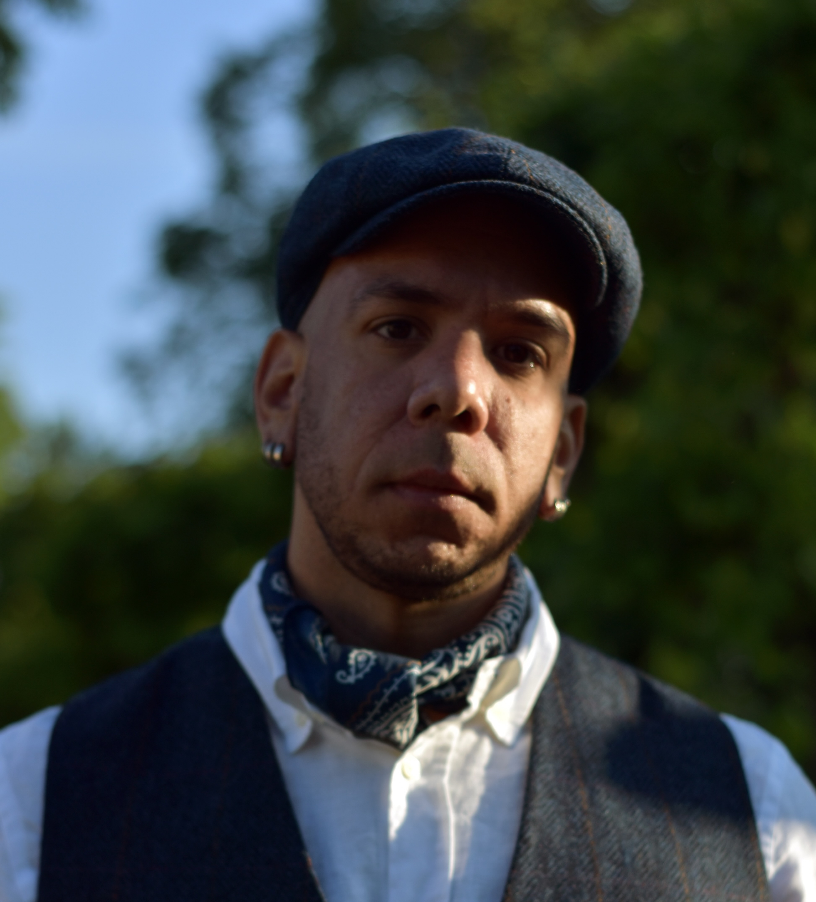
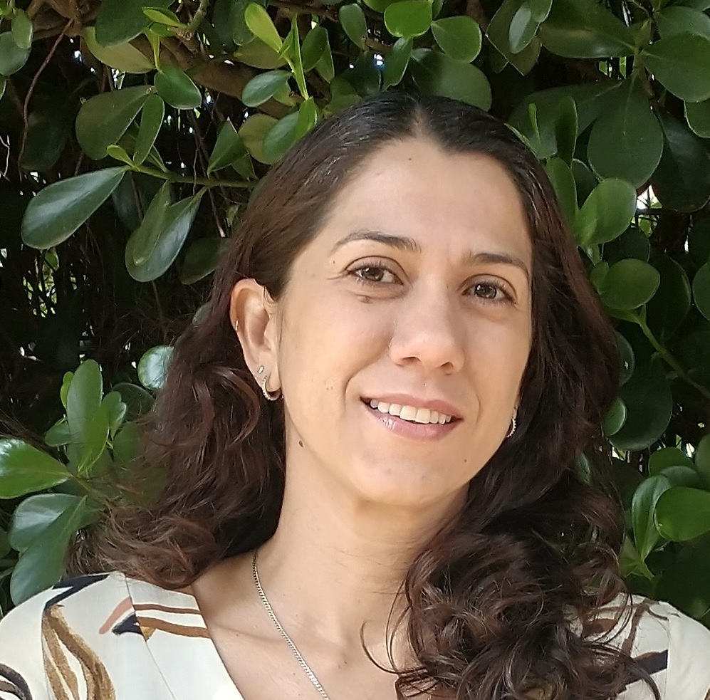
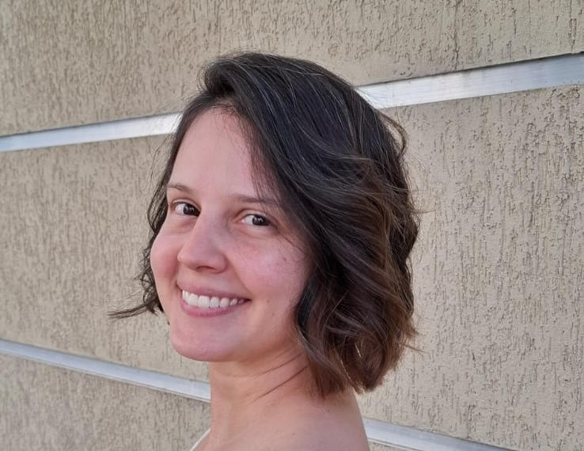
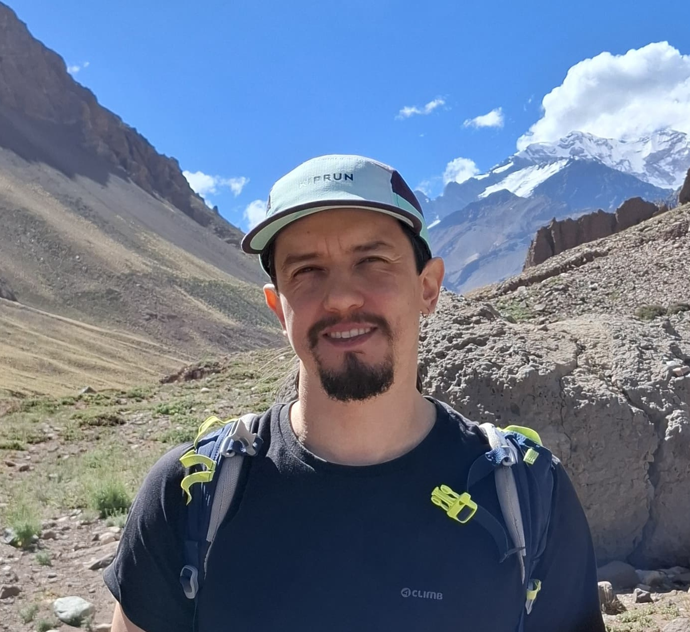

# Equipe 🧑‍🏫

## Instrutores

### George Pacheco

    
Graduei-me em Ciências Biológicas (Bacharelado e Licenciatura) pela <a href="https://www.ufrn.br/" target="_blank">Universidade Federal do Rio Grande do Norte</a>. Fiz mestrado e doutorado pelo <a href="https://snm.ku.dk/english/" target="_blank"><i>Natural History Museum of Denmark</i></a> — <a href="https://www.ku.dk/english/" target="_blank"><i>University of Copenhagen</i></a>, trabalhando no campo da genômica evolutiva aviana, especificamente estudando os padrões genômico-evolutivos do pombo-das-rochas. Ainda na Dinamarca, fiz um primeiro pós-doc no <a href="https://www.aqua.dtu.dk/english" target="_blank"><i>Aqua National Institute of Aquatic Resources</i></a> — <a href="https://www.dtu.dk/english" target="_blank"><i>Technical University of Denmark</i></a>, onde investiguei as marcas genômicas em resposta à recente evolução de cinco espécies de peixes frente às condições ambientais do Mar Báltico. Fiz o meu segundo pós-doc na Noruega junto ao <a href="https://www.mn.uio.no/cees/english/" target="_blank"><i>Centre for Ecological and Evolutionary Synthesis</i></a> — <a href="https://www.uio.no/english/" target="_blank"><i>University of Oslo</i></a>. Aqui voltei à genômica evolutiva aviana e investiguei a evolução genômica de um grupo de pardais. Durante a minha carreira, eu trabalhei em vários projetos na área de genômica evolutiva animal investigando uma ampla variedade de táxons — de pequenos colêmbolos a orcas com evolução cultural, o que me proporcionou vasta experiência em laboratório molecular e uma compreensão sólida da lógica por trás das análises bioinformáticas. Hoje, tenho interesse em estudos sobre as bases (epi)genômicas de fenômenos cognitivos dos dinossauros viventes — as aves.

        

            

                
            

            

                <a href="https://g-pacheco.github.io/" target="_blank" rel="noopener noreferrer" style="font-size: 24px; text-decoration: none;">
                    <i class="fa fa-globe"></i>
                </a>
                <a href="https://scholar.google.dk/citations?hl=en&user=FSCWyqAAAAAJ&view_op=list_works&sortby=pubdate" target="_blank" rel="noopener noreferrer" style="font-size: 24px; text-decoration: none;">
                    <i class="ai ai-google-scholar"></i>
                </a>
                <a href="http://lattes.cnpq.br/8779597063731617" target="_blank" rel="noopener noreferrer" style="font-size: 24px; text-decoration: none;">
                    <i class="ai ai-lattes"></i>
                </a>
                <a href="mailto:ramelet13@gmail.com" target="_blank" rel="noopener noreferrer" style="font-size: 24px; text-decoration: none;">
                    <i class="fa fa-envelope-o"></i>
                </a>
            

        

### Mariana Vasconcellos

    
Sou pesquisadora de pós-doutorado no <a href="https://www.ib.usp.br/zoologia.html" target="_blank">Departamento de Zoologia</a> da <a href="https://www5.usp.br/" target="_blank">USP</a>, onde investigo os impactos das mudanças climáticas na demografia histórica e padrões adaptativos de sapos e lagartos da Mata Atlântica. Utilizo sequenciamento de genomas completos e técnicas de representação reduzida do genoma para identificar assinaturas demográficas associadas a variações climáticas passadas, além de explorar padrões macroevolutivos relacionados ao clima e seu impacto na história evolutiva das espécies. Graduei-me em Ciências Biológicas pela <a href="https://www.unb.br/" target="_blank">Universidade de Brasília</a>, com Mestrado em Ecologia pela mesma instituição. Concluí o doutorado em Ecologia, Evolução e Comportamento Animal pela <a href="https://www.utexas.edu/" target="_blank"><i>University of Texas at Austin</i></a>, onde investiguei a influência do clima na diversificação de sapos do Cerrado. Possuo experiência com genômica evolutiva de animais e plantas. Durante meu pós-doutorado na <a href="https://www.cuny.edu/" target="_blank"><i>City University of New York</i></a>, em colaboração com o <a href="https://www.nybg.org/" target="_blank"><i>New York Botanical Garden</i></a>, desenvolvi um estudo avaliando assinaturas genômicas de impacto do clima e da ação dos povos indígenas nas Araucarias do sul do Brasil. Recentemente, como pesquisadora visitante na <a href="https://www.uantwerpen.be/en/" target="_blank"><i>University of Antwerp</i></a>, realizei a montagem e anotação do genoma em nível cromossômico do lagarto <i>Enyalius iheringii</i> para estudos de genômica adaptativa na Mata Atlântica.

        

            

                
            

            

                <a href="https://scholar.google.com/citations?hl=en&user=HAgf41AAAAAJ&view_op=list_works&sortby=pubdate" target="_blank" rel="noopener noreferrer" style="font-size: 24px; text-decoration: none;">
                    <i class="ai ai-google-scholar"></i>
                </a>
                <a href="http://lattes.cnpq.br/1881762718218903" target="_blank" rel="noopener noreferrer" style="font-size: 24px; text-decoration: none;">
                    <i class="ai ai-lattes"></i>
                </a>
                <a href="mailto:marimiravasc@gmail.com" target="_blank" rel="noopener noreferrer" style="font-size: 24px; text-decoration: none;">
                    <i class="fa fa-envelope-o"></i>
                </a>
            

        

### Waldir Miron

    
Eu me interesso pelos processos evolutivos que geram biodiversidade, desde a microevolução (ecologia molecular, evolução de sistemas reprodutivos, seleção sexual, plasticidade fenotípica) até a macroevolução (filogenética e filogeografia, biogeografia e genética da conservação). Me formei em Ciências Biológicas pela <a href="https://www.ufrn.br/" target="_blank">Universidade Federal do Rio Grande do Norte</a>. Concluí meu mestrado pelo <a href="https://sigaa.ufrn.br/sigaa/public/programa/portal.jsf?lc=pt_BR&id=5579" target="_blank">Programa de Pós-graduação em Sistemática e Evolução</a> em 2014 na mesma instituição, com um breve período como pesquisador visitante na <a href="https://www.dal.ca/" target="_blank"><i>Dalhousie University</i></a> (Canadá). Realizei meu doutorado na <a href="https://www.swansea.ac.uk/" target="_blank"><i>Swansea University</i></a> (Reino Unido) e meu projeto teve como objetivo principal entender como os peixes autofertilizantes (rivulídeos de mangue) lidam com a variabilidade ambiental, examinando a relação entre variabilidade epigenética e genética, bem como suas consequências evolutivas. Fui pesquisador de pós-doutorado na <a href="https://www.ou.edu/" target="_blank"><i>University of Oklahoma</i></a>, com foco na integração entre a biologia reprodutiva e a plasticidade fenotípica multigeracional em peixes da família Poeciliidae. Atualmente, sou professor na <a href="https://uwf.edu/" target="_blank"><i>University of West Florida</i></a> e meu laboratório continua focado em projetos na interseção entre a biologia evolutiva e a reprodutiva.

        

            

                
            

            

                <a href="https://waldirmbf.github.io/" target="_blank" rel="noopener noreferrer" style="font-size: 24px; text-decoration: none;">
                    <i class="fa fa-globe"></i>
                </a>
                <a href="https://scholar.google.dk/citations?hl=pt-BR&user=30a5mKUAAAAJ&view_op=list_works&sortby=pubdate" target="_blank" rel="noopener noreferrer" style="font-size: 24px; text-decoration: none;">
                    <i class="ai ai-google-scholar"></i>
                </a>
                <a href="http://lattes.cnpq.br/5643358622376992" target="_blank" rel="noopener noreferrer" style="font-size: 24px; text-decoration: none;">
                    <i class="ai ai-lattes"></i>
                </a>
                <a href="mailto:waldirmbf@gmail.com" target="_blank" rel="noopener noreferrer" style="font-size: 24px; text-decoration: none;">
                    <i class="fa fa-envelope-o"></i>
                </a>
            

        

## Monitores

### Ana Cecilia Holler del Prette

    
Sou doutoranda do <a href="https://sites.icb.ufmg.br/pgzooufmg/" target="_blank">Programa de Pós-Graduação em Zoologia</a> da <a href="https://www.ufmg.br/" target="_blank">UFMG</a>, onde investigo a história evolutiva de duas espécies de pererecas-macaco do Cerrado, por meio do estudo da presença e dinâmica de fluxo gênico entre elas. Utilizando uma abordagem integrativa, combino sequenciamento genômico e caracteres fenotípicos, como morfologia e padrão de coloração, para compreender melhor esse carismático sistema biológico que são as <i>Pithecopus ayeaye</i> e <i>P. oreades</i>. Realizei minha graduação e mestrado na <a href="https://www.unb.br/" target="_blank">UnB</a>, período em que tive a oportunidade pude explorar diferentes áreas, como demografia de lagartos, entomologia forense, anatomia animal e conservação. Também me aventurei na genética durante uma graduação sanduíche na <a href="https://www.fsu.edu/" target="_blank"><i>Florida State University</i></a>, até me encontrar na biologia evolutiva na qual pretendo continuar com minhas pesquisas.

        

            

                
            

            

                <a href="https://scholar.google.dk/citations?hl=pt-BR&user=ds1dV1gAAAAJ&view_op=list_works&sortby=pubdate" target="_blank" rel="noopener noreferrer" style="font-size: 24px; text-decoration: none;">
                    <i class="ai ai-google-scholar"></i>
                </a>
                <a href="http://lattes.cnpq.br/7984907807703207" target="_blank" rel="noopener noreferrer" style="font-size: 24px; text-decoration: none;">
                    <i class="ai ai-lattes"></i>
                </a>
                <a href="mailto:anacecilia.holler@gmail.com" target="_blank" rel="noopener noreferrer" style="font-size: 24px; text-decoration: none;">
                    <i class="fa fa-envelope-o"></i>
                </a>
            

        

### Jean Oliveira

    
Graduado em Ciências Biológicas pela <a href="https://unipampa.edu.br/portal/#" target="_blank">Universidade Federal do Pampa</a>, com TCC na área de Citogenética. No mestrado e doutorado em Genética pela <a href="https://www.ufmg.br/" target="_blank">Universidade Federal de Minas Gerais</a>, migrei para Genética Evolutiva e de Populações, tendo estudado genética de populações dos Pinguins de Adélia na Península Antártica e filogenômica de beija-flores da Amazônia e Cerrado. Concluí meu primeiro pós-doutorado como Bioinformata na <a href="https://www.pucminas.br/destaques/Paginas/default.aspx" target="_blank">PUC Minas</a>, analisando genomas de Aves para estudos filogeográficos, genômica da conservação e identificação de genes associados ao leucismo. Meu gosto pela genômica e bioinformática vem da integração de grandes dados, mas também adoro acumular experiências de campo. Além disso, tenho interesse por divulgação científica, trabalhos manuais, escalada em rocha e passar o tempo com meus gatos.

        

            

                
            

            

                <a href="https://scholar.google.com/citations?hl=en&user=kzJ2LlQAAAAJ&view_op=list_works&sortby=pubdate" target="_blank" rel="noopener noreferrer" style="font-size: 24px; text-decoration: none;">
                    <i class="ai ai-google-scholar"></i>
                </a>
                <a href="http://lattes.cnpq.br/9394209095599461" target="_blank" rel="noopener noreferrer" style="font-size: 24px; text-decoration: none;">
                    <i class="ai ai-lattes"></i>
                </a>
                <a href="mailto:pedrosojco@gmail.com" target="_blank" rel="noopener noreferrer" style="font-size: 24px; text-decoration: none;">
                    <i class="fa fa-envelope-o"></i>
                </a>
            

        

